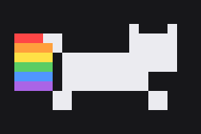

# 🐱 TokenCat — 프로젝트 포트폴리오

<p align="center">
  
</p>

> **한 줄 정의**: macOS 메뉴바에서 픽셀 고양이가 뛰어다니고, Claude(Claude Code) 토큰
> 소모 속도가 빨라질수록 고양이도 빨라진다. 클릭하면 RunCat 스타일 팝오버로
> 5시간 세션·주간 사용량을 보여준다.

| | |
|---|---|
| **역할** | 기획·개발·배포 전 과정 (개인 프로젝트) |
| **기간** | 2026.07 (이틀 — 기획안 작성 → M0~M3 → v1.1 → 오픈소스 배포) |
| **스택** | Swift 5.9 · SwiftUI + AppKit(NSStatusItem) · SPM · macOS 13+ |
| **레퍼런스 UX** | RunCat(메뉴바 러너 + 다크 팝오버) × 냥캣(픽셀 아트 + 무지개 트레일) |
| **저장소** | https://github.com/Mm-767/TokenCat (MIT, 소스 배포 — `./install.sh` 한 줄 설치) |

---

## 1. 목표 / 비목표

**목표**
- 코딩 중 시선 이동 없이 "지금 토큰을 얼마나 태우고 있는지"를 **고양이 속도로 체감**하게 한다.
- 클릭 한 번으로 5시간 세션 사용량, 주간 사용량, 오늘 토큰/추정 비용, 리셋 시각을 확인한다.
- 한도 임박(80%/95%) 시 고양이 상태 변화 + macOS 알림으로 "한도 초과 서프라이즈"를 방지한다.

**비목표 (v1에서 하지 않은 것)** — Windows/Linux 지원, 팀 단위 집계, 과거 통계
차트 화면, App Store 배포.

## 2. 핵심 성과 요약

| 항목 | 결과 |
|---|---|
| 집계 정확도 | 검증 도구 `ccusage blocks`와 동시점 대조 **오차 0.00%** (샌드위치 검증: 측정→대조→측정) |
| 공식 게이지 | 비문서화 OAuth usage 엔드포인트 실측 연동 — Claude Code `/usage`와 동일 값 |
| 성능 | 유휴 CPU **0.1~0.2%** (예산 0.5%), 메모리 **12MB** (예산 50MB) — 격리 환경 실측 |
| 품질 | 단위 테스트 **53개** (파서·중복제거·블록·보간·알림 정책·캘리브레이션) |
| 데이터 검증 | 실물 JSONL 1,432건 분석 → **중복 기록(최대 6줄) 발견**, 중복제거 미적용 시 2.9배 과대집계 확인 |
| 배포 | `git clone` + `./install.sh` 3줄 설치 (로컬 빌드 → Gatekeeper 차단 없음), MIT 오픈소스 |

## 3. 데이터 소스 설계 — 실물 우선 검증

> 원칙: 문서·추측보다 실물 데이터 우선. 구현 첫날(M0)에 스파이크로 재검증했다.

| 항목 | 내용 |
|---|---|
| 원천 데이터 | `~/.claude/projects/**/*.jsonl` — Claude Code가 세션별 대화·usage 기록. assistant 메시지에 `message.usage`(input/output/cache_creation/cache_read tokens), `timestamp`, `message.model`, `requestId` |
| 검증된 선례 | ccusage(CLI)가 동일 JSONL을 파싱해 일별/세션/5시간 블록 리포트 제공 — 파싱·중복제거·단가 로직 참조 |
| 5시간 블록 | 첫 활동 시각을 UTC 정시로 내림(floor)한 시점부터 5시간 창 (ccusage와 동일 규칙) |
| 주간 사용량 | 기본 최근 7일 롤링 합계, 설정에서 리셋 요일/시각 수동 지정 가능 |
| **공식 사용량 % (게이지 1순위)** | **비문서화 OAuth usage 엔드포인트** — Claude Code가 로컬에 저장한 OAuth 토큰으로 조회하면 `/usage`와 동일한 세션·주간 %와 리셋 시각 응답. **웹/데스크톱 사용량까지 합산된 계정 단위 공식 데이터**라 플랜 선택·캘리브레이션 없이 정확. 운용 규칙: 폴링 180초, 올바른 User-Agent 필수(없으면 429 지속), 토큰 만료 대응 |
| 추정 모드 (폴백) | 엔드포인트 실패·변경 시: 플랜 프리셋 대비 JSONL 집계로 추정 + "(추정)" 라벨 + `/usage` 캘리브레이션 |
| 주의 | 2026-06-15부터 프로그래매틱 사용(Agent SDK, `claude -p`)은 별도 크레딧 풀 — v1은 entrypoint의 "sdk" 마커로 분리 표시 |

**역할 분담(하이브리드)**: 세션/주간 **게이지 % = 공식 엔드포인트**(계정 단위, 웹 포함),
고양이 속도·오늘 토큰·스파크라인 = **로컬 JSONL**(초 단위 실시간, Claude Code분).
두 소스를 UI에서 명확히 분리 표기 (✓공식 배지 / "(추정)" 라벨).

**M0 스파이크에서 발견한 것 (문서와 실물의 차이)**
- 같은 응답이 스트리밍 청크 단위로 **최대 6줄 중복 기록** → `message.id + requestId`
  조합으로 중복 제거 필수 (미적용 시 2.9배 과대집계). 1,432건 → 고유 497건 실측.
- usage가 전부 0인 `<synthetic>` 모델 레코드 존재 → 명시적 스킵.
- 공식 세션 리셋 시각은 UTC 정시가 아님(실측 11:50Z) → 게이지 리셋은 공식
  `resets_at`, 로컬 블록 계산은 속도·토큰량 전용으로 분리.
- 응답에 절대값(한도 달러/토큰) 없음 → 보간은 실측 역산으로 (트러블슈팅 사례 2).
- 산출물: `docs/jsonl-schema.md`, `docs/usage-endpoint.md`

## 4. 핵심 기능

### F1. 메뉴바 러너 (NSStatusItem)
- 22pt 메뉴바에 픽셀 고양이 스프라이트 애니메이션 (8프레임 달리기 사이클,
  36×22pt @1x / 72×44 @2x).
- 냥캣 오마주는 **자체 제작 에셋만** 사용 (원작 이미지 미사용 — §리스크).
- 다크/라이트 메뉴바 대응: 동적 색상으로 그린 프레임을 상태 전환 시 1회
  래스터라이즈(테마 변경 감지 시 재생성) — 40ms 프레임마다 다시 그리지 않아 CPU 절약.

### F2. 속도 매핑 (핵심 재미 요소)
- 신호: **burn rate = 최근 60초 토큰 소모량(tokens/min)**, EMA(α=0.3) 스무딩.
- 5단계 상태 머신:

| 상태 | 조건 (tokens/min) | 애니메이션 | 프레임 간격 |
|---|---|---|---|
| 😴 잠자기 | 0 (5분 이상 무활동) | 웅크려 잠, Z 글자 2프레임 | 1000ms |
| 🚶 산책 | 1 ~ 2,000 | 걷기 | 200ms |
| 🏃 달리기 | 2,000 ~ 10,000 | 달리기 | 100ms |
| 💨 질주 | 10,000 ~ 30,000 | 달리기(속도업) | 60ms |
| 🌈 무지개 모드 | 30,000+ | 달리기 + 무지개 트레일 | 40ms |

- 임계값은 `Thresholds.swift` 상수 + 설정에서 민감도(낮음/보통/높음) 3단 조절.
- **한도 임박 오버라이드**: 사용률 80% 이상이면 상태와 무관하게 🥵 지친 고양이
  (헐떡임+땀방울), 95% 이상이면 ⚠️ 빨간 경고 프레임.

### F3. 사용량 팝오버 (RunCat 레이아웃)
러너 클릭 → NSPopover(다크 머티리얼, 폭 360pt). 좌측 정보 카드 + 우측 버튼 열.

```
🐱  세션 (5시간)  : 42.3% ✓공식     ← 게이지 바, "2시간 18분 후 리셋"(공식 값)
     Claude Code 소모: 1.24M tokens (JSONL 집계)
────────────────────────────
📅  주간 사용량   : 61.0% ✓공식     ← 게이지 바, 리셋 시각(공식 값)
     Opus 12% · Sonnet 88% (모델 비중, JSONL 기준)
────────────────────────────
🔥  현재 속도     : 8,420 tok/min  ← 최근 30분 스파크라인 미니 그래프
     상태: 달리기 🏃
────────────────────────────
💰  오늘         : 3.1M tokens · $12.40 (API 단가 환산 추정)
────────────────────────────
📦  데이터: 공식 연동 ✓ (폴백 시 "추정 모드")  ← 클릭 시 설정으로 이동
```

우측 버튼 열: 🐾 러너 색상 테마(3종 순환) · 📊 일별 상세 시트 · 🔄 새로고침(공식 %
즉시 재조회) · ⚙️ 설정 · ⏻ 종료.
게이지 색: 0~60% 파랑 → 60~80% 노랑 → 80%+ 빨강. **모든 추정값에 "(추정)" 라벨 —
정직한 UI가 신뢰를 만든다.**

**갱신 전략 (체감 실시간화)**
- 공식 % 폴링 180초(429 방지 안전 간격) + **팝오버 여는 순간 즉시 1회 재조회**
  (직전 30초 이내면 생략).
- **보간 게이지**: 마지막 공식 % 위에, 이후 JSONL로 감지된 소모분을 실측 역산
  스케일로 환산해 실시간으로 얹음. "공식 N분 전 · 보간 중" 캡션 표기.
  (환산 스케일 설계는 트러블슈팅 사례 2 참조)

### F4. 알림
- 세션/주간 80%·95% 도달 시 **각 1회** macOS 알림. 예: "🥵 세션 한도 80% —
  약 1시간 12분 분량 남음(현재 속도 기준)". 창 리셋 시 발송 기록 초기화,
  70→96% 건너뛰면 95만 발송(스팸 방지) — 정책을 순수 로직으로 분리해 단위 테스트.
- 5시간 블록 리셋 시 "새 세션 시작!" 알림 (옵션, 기본 off).
- 오탐 방지: 공식 값 수신 전(시작 직후·일시 실패)에는 알림·오버라이드 평가 보류.

### F5. 설정 (UserDefaults)
- 공식 연동 on/off (off·실패 시 추정 모드 폴백)
- 플랜 선택: Pro / Max 5x / Max 20x / Custom(한도 직접 입력)
- 한도 캘리브레이션: `/usage` 실측 % 입력 → 세션·주간 한도 역산 보정 (관용 파싱,
  성공/실패 즉시 피드백)
- 주간 리셋 요일·시각 / 민감도 3단 / 러너 색상 테마 / 한도·새 세션 알림 /
  로그인 시 자동 시작(SMAppService) / 폴링 주기(기본 3초)

## 5. 기술 아키텍처

**스택**: Swift 5.9+ · SwiftUI(팝오버/설정) + AppKit(NSStatusItem) · macOS 13+ ·
SPM. 테스트 가능한 코어(`UsageCore` 라이브러리)와 앱 계층 분리.

```
TokenCat/
├── Sources/UsageCore/          # 순수 로직 — 단위 테스트 53개의 대상
│   ├── JSONLWatcher.swift      #   ~/.claude/projects 재귀 감시, 파일별 오프셋 증분 파싱
│   ├── JSONLParser.swift       #   스키마-관용 파싱, <synthetic> 스킵
│   ├── UsageStore.swift        #   중복제거(message.id+requestId) + 집계(오늘/주간/모델/스파크라인)
│   ├── BlockCalculator.swift   #   5시간 블록(UTC floor)
│   ├── BurnRateMeter.swift     #   60초 창 tokens/min + EMA
│   ├── OAuthUsageProvider.swift#   공식 % 폴링: 토큰 캐시 + security 서브프로세스 + 파일 폴백
│   ├── GaugeMath.swift         #   보간 게이지 실측 역산 (사례 2)
│   ├── PlanLimits.swift        #   플랜 프리셋 + 캘리브레이션 역산
│   ├── WeeklyWindow.swift      #   롤링 7일 / 사용자 리셋 창
│   └── UsageAlerts.swift       #   80/95% 알림 정책 (창별 1회)
├── Sources/TokenCat/
│   ├── App/                    #   AppDelegate(NSStatusItem), UsageEngine, AppSettings
│   ├── SpriteEngine/           #   SpriteAnimator, 코드 생성 픽셀 고양이, 래스터라이저
│   ├── UI/                     #   PopoverView, GaugeBar, Sparkline, SettingsView, DailyDetailView
│   ├── Services/               #   Notifier(UserNotifications), LaunchAtLogin(SMAppService)
│   └── Assets/                 #   PNG 넣으면 자동 교체되는 스프라이트 폴더
├── docs/                       #   jsonl-schema.md, usage-endpoint.md (M0 실측 산출물)
└── scripts/                    #   build-app.sh, setup-signing.sh, install.sh, generate-brand.py
```

**성능 예산 vs 실측**: 유휴 CPU < 0.5% → **0.1~0.2%**, 메모리 < 50MB → **12MB**.
파싱은 백그라운드 큐, 풀스캔은 시작 시 1회, 이후 파일 오프셋 기억 증분.
유휴 측정은 `CLAUDE_CONFIG_DIR`로 빈 데이터 디렉토리를 지정한 격리 인스턴스로 수행.

**대안 스택 검토**: Python + rumps로 반나절 MVP 가능하나 애니메이션 fps·배포에
한계 → Swift 채택. Electron은 러너 앱 용도로 리소스 과다라 배제.

## 6. 보안 설계 — macOS 키체인 접근 (필수 준수 규칙)

Claude Code는 macOS에서 OAuth 토큰을 키체인 항목 `Claude Code-credentials`(로그인
키체인)에 저장한다. 이 항목은 ACL로 보호되어 **다른 앱이 읽으면 macOS가 암호
프롬프트를 띄우는 것이 정상 동작**이다. 반복 원인과 대응:

| 원인 | 대응 규칙 |
|---|---|
| 매 폴링(3분)마다 키체인 읽기 | **금지.** 토큰을 메모리 캐시, 만료(~60분) 시에만 재읽기 → 빈도 1/20 |
| "허용"만 클릭(1회성) | 첫 실행 안내에서 **"항상 허용(Always Allow)"** 누르도록 안내 |
| 빌드마다 코드서명 변경(ad-hoc) → "항상 허용" 무효화 | 개발 중에도 **고정 서명 identity** 사용 (self-signed 인증서 생성·고정 스크립트 제공) |
| 앱이 Security.framework 직접 호출 | `/usr/bin/security find-generic-password ...` 서브프로세스 — ACL 대상이 Apple 서명 불변 바이너리가 되어 **리빌드해도 프롬프트 재발 없음** (트레이드오프는 README에 명시) |
| 그래도 프롬프트가 싫은 경우 | 폴백 순서: ⑴ `~/.claude/.credentials.json` 파일 우선(프롬프트 없음) ⑵ 키체인 ⑶ 실패 시 추정 모드 |

**절대 금지**: `security unlock-keychain` 자동화, 키체인 암호 저장·자동입력 —
편하자고 보안을 무너뜨리는 안티패턴. **OAuth 토큰은 읽기 전용, Anthropic 외
어디에도 전송·저장·로깅하지 않는다.**

## 7. 트러블슈팅 기록 (3건)

### 사례 1. macOS 키체인 암호 프롬프트 반복

**TL;DR** — 토큰을 읽을 때마다 키체인 암호 프롬프트가 반복됐다. 원인을 "버그"가
아닌 **키체인 ACL의 정상 보안 동작**으로 규정하고, 접근 빈도(메모리 캐시)·승인
방식(항상 허용 안내)·코드서명(고정 identity + security 서브프로세스) 3개 축으로
분해해 **프롬프트를 최초 1회로** 줄였다. 핵심 발견: ACL은 **코드서명 단위**로
신뢰를 기억하므로 ad-hoc 서명은 빌드마다 승인이 무효화된다 — 서명 전략은 배포뿐
아니라 **런타임 UX 문제**다. `unlock-keychain` 자동화류는 의도적으로 배제.
(원인·대응 상세 표는 §6 참조)

### 사례 2. 실시간 보간 게이지 폭주 — 오탐 "100% 경고"

**TL;DR** — 공식 % 위에 로컬 소모분을 얹는 보간 게이지가 몇 분 만에 100%로
폭주하며 빨간 고양이·95% 오탐 알림을 냈고, 팝오버를 열면(재조회) 잠깐 정상으로
돌아와 "클릭해야 갱신되는 버그"처럼 보였다.

| | 코드의 가정 | 실측 |
|---|---|---|
| 공식 1%에 해당하는 로컬 토큰 | 5,000 (플랜 한도 500K÷100) | **약 60,000** (블록 4M ÷ 공식 63%) |
| 5분간 30만 토큰 소모 시 보간 | **+60%p** (폭주) | +5.1%p |

원인은 **단위가 다른 두 데이터를 고정 상수로 환산**한 것 — 로컬 로그 토큰은 캐시
읽기가 지배해 실제 한도 소진의 수십 배 스케일이었다. 환산 비율을 **실측
역산**(조회 시점 창 토큰 ÷ 공식 %)으로 바꾸고, 역산이 불안정한 구간(공식 5%
미만)은 보간을 생략하며, 알림의 잔여 시간 추정도 같은 스케일로 일원화(`GaugeMath`
모듈 + 테스트 6개). 같은 시나리오에서 123%→100% 폭주가 **68.1%**로 정확해졌다.
배운 점: **이종 소스를 섞을 때는 단위부터 검증하고, 모르는 환산 비율은 상수로
가정하지 말고 시스템이 주는 실측으로 캘리브레이션하라.**

### 사례 3. "새로고침이 안 돼요" — 스로틀과 App Nap

**TL;DR** — 두 갈래 증상. ① 새로고침 버튼이 동작하지 않음: 팝오버를 여는 순간
공식 %를 이미 조회하고 30초 스로틀(429 방지)이 걸리므로, 직후 버튼을 눌러도
항상 생략됐다 → **사용자 명시 동작은 스로틀을 우회**(연타 방지 5초만 유지)하도록
경로를 분리. ② 장시간 실행 중 데이터 갱신 정지 의심: 메뉴바 전용 앱은 App Nap
대상이라 백그라운드 타이머가 지연될 수 있는데, **애니메이션 타이머(메인 스레드)는
계속 돌아 "살아있는데 데이터만 멈춘" 것처럼 보인다** → `ProcessInfo.beginActivity`로
냅 방지 + os.log 기반 진단(3초 틱 요약, 공식 조회 결과, 틱 지연 경고)을 내장해
재발 시 `log stream` 한 줄로 확인 가능하게 했다. 배운 점: **자동 폴링의 보호
장치(스로틀)가 사용자 명시 동작까지 삼키면 "고장"으로 인식된다 — 경로를 분리하고,
관측 가능성(logging)을 제품에 내장하라.**

## 8. 마일스톤 & 결과

| 단계 | 계획 | 완료 기준 | 결과 |
|---|---|---|---|
| M0 (0.5일) | JSONL 스키마 실물 검증, ccusage 블록 로직 대조, OAuth 엔드포인트 실측 | `docs/jsonl-schema.md` + 파서 단위테스트 | ✅ 중복 6줄·synthetic 발견, 엔드포인트 HTTP 200 실측 |
| M1 MVP (2일) | 메뉴바 러너 + burn rate 연동 + 최소 팝오버 | 실사용 중 고양이 속도 체감 일치 | ✅ |
| M2 (2일) | 공식/주간 게이지, 플랜 설정·캘리브레이션, 스파크라인 | ccusage 오차 < 2% | ✅ **오차 0.00%** |
| M3 (1~2일) | 알림, 지친 고양이, 자동 시작, 서명, README | dmg 배포 가능 | ✅ + 소스 배포(install.sh) 채택 |
| v1.1 | 러너 테마 3종, 일별 상세, 무지개 전용 에셋 경로, 프로그래매틱 분리 표시 | — | ✅ |

## 9. 수용 기준 (Acceptance Criteria) — 최종 체크

- [x] Claude Code에서 대화 시 3초 이내에 고양이 속도가 반응한다 (3초 증분 폴링)
- [x] 5분 무활동 시 고양이가 잠든다 (상태머신 테스트 + 실측)
- [x] 공식 연동 상태에서 세션/주간 %가 `/usage` 표시값과 일치 (동일 엔드포인트)
- [x] 공식 연동 off·실패 시 추정 모드 자동 전환 + "(추정)" 라벨
- [x] 세션 토큰 합계가 `ccusage blocks` 현재 블록과 오차 2% 이내 → **0.00%**
- [x] 플랜 변경·캘리브레이션 즉시 게이지 반영
- [x] 80%/95% 알림이 각 1회만 발송 (정책 단위테스트 7개)
- [x] 유휴 CPU < 0.5% → **0.1~0.2% 실측**
- [x] 추정값에는 항상 "(추정)" 라벨

## 10. 리스크 & 대응

| 리스크 | 대응 |
|---|---|
| 비문서화 usage 엔드포인트 변경·차단 | 추정 모드 자동 폴백(앱이 죽지 않음), 폴링 180초·User-Agent 준수, 응답 스키마 관용 파싱(`limits[]` 배열 폴백 포함). 토큰은 로컬 읽기 전용 |
| Claude Code의 JSONL 포맷 변경 | 파서 스키마-관용(필드 누락 시 skip), 버전 감지 |
| 공식 한도와 추정치 괴리 | "(추정)" 라벨 + `/usage` 캘리브레이션 + README에 한계 명시 |
| 냥캣 원작 저작권 | 스프라이트 전부 자체 제작(오마주 수준), Nyan Cat 이름 미사용 |
| 프로그래매틱 사용(별도 크레딧 풀) 혼입 | entrypoint "sdk" 마커로 분리 표시 + 관용 판별임을 문서 명시 |
| 다수 프로젝트 폴더로 시작 풀스캔 지연 | 파일 mtime 필터(최근 8일) + 오프셋 증분 파싱 |

## 11. 플랜 프리셋 (폴백 전용 상수)

공식 연동 실패 시 추정 모드에서만 쓰는 초기 추정값 — `/usage` 캘리브레이션으로 덮어쓴다.

```json
{
  "pro":    { "session_tokens_est": 500000,  "weekly_multiplier_est": 8 },
  "max5x":  { "session_tokens_est": 2500000, "weekly_multiplier_est": 8 },
  "max20x": { "session_tokens_est": 10000000,"weekly_multiplier_est": 8 },
  "custom": { "session_tokens_est": null,    "weekly_multiplier_est": null }
}
```

## 12. 배포 & 사용

**설치 (터미널 3줄)** — 로컬 빌드라 Gatekeeper "확인되지 않은 개발자" 차단이 없다:

```bash
git clone https://github.com/Mm-767/TokenCat.git
cd TokenCat
./install.sh     # 서명 identity 준비 → 빌드 → /Applications 설치 → 실행
```

- **요구사항**: macOS 13+, Claude Code 로그인, Swift 툴체인(`xcode-select --install`)
- **첫 실행 (각 1회)**: 키체인 프롬프트에 **[항상 허용]**, 서명 신뢰 등록 암호 1회, 알림 권한
- **다시 켜기**: Spotlight(`⌘+Space` → TokenCat) / `open -a TokenCat` / 설정의 "로그인 시 자동 시작"
- **업데이트**: `git pull && ./install.sh` · **제거**: 응용 프로그램 폴더에서 삭제
- **개발**: `swift run TokenCat` · `swift test` · `.build/debug/TokenCat --report`(ccusage 대조) ·
  진단 `log stream --predicate 'subsystem == "dev.tokencat.TokenCat"' --level debug`
- **스프라이트 교체**: `Sources/TokenCat/Assets/`에 `cat_run_0~7.png` 등 규격 PNG를 넣고
  재빌드하면 자동 적용, 없으면 코드 생성 고양이(색상 테마 3종)로 폴백

## 13. 한계 (정직하게)

- 공식 % 조회는 **비문서화 API** — 변경·차단될 수 있고, 그 경우 자동으로 추정 모드 폴백 (앱은 죽지 않는다).
- 추정 모드의 플랜 한도는 커뮤니티 추정치 — 캘리브레이션으로 보정.
- 프로그래매틱(SDK) 판별 마커는 실측 데이터에 SDK 레코드가 없어 "sdk" 포함 여부로 관용 판별 — 추정임을 문서 명시.
- 키체인 읽기의 `/usr/bin/security` 방식은 "항상 허용" 후 다른 프로세스도 같은 경로로
  읽을 수 있게 되는 트레이드오프 — 숨기지 않고 문서화해 사용자가 선택.

## 14. 배운 점 종합

1. **실물 우선**: 문서·통념 대신 실제 JSONL 1,432건을 먼저 분석해 중복 기록이라는
   결정적 함정을 첫날 발견했다. 스파이크 비용 반나절이 이후 모든 집계의 신뢰를 만들었다.
2. **보안 동작과 버그의 구분**: 키체인 프롬프트를 우회하지 않고 OS 규칙 안에서
   접근 빈도·신뢰 단위를 재설계했다. 트레이드오프는 문서화로 사용자에게 선택권을 줬다.
3. **이종 데이터 결합은 단위 검증부터**: 같은 "토큰"이라도 계정 한도와 로그의
   토큰은 다른 물리량 — 고정 상수 대신 실측 역산 캘리브레이션.
4. **관측 가능성은 제품 기능**: "갱신이 안 된다"는 모호한 제보를 위해 진단 로깅을
   내장했다 — 다음 제보는 `log stream` 한 줄로 원인이 좁혀진다.
5. **정직한 UI**: 모든 추정값에 "(추정)" 라벨, 공식 값에 ✓ 배지. 정확도의 한계를
   숨기지 않는 것이 신뢰를 만든다.

## 15. 참고 자료

- OAuth usage 엔드포인트 논의(Claude-Code-Usage-Monitor #202): https://github.com/Maciek-roboblog/Claude-Code-Usage-Monitor/issues/202
- 공식 % 트레이 앱 선례(usage-monitor-for-claude): https://github.com/jens-duttke/usage-monitor-for-claude
- ccusage 5시간 블록 리포트: https://ccusage.com/guide/blocks-reports
- 실시간 모니터 선례(Claude-Code-Usage-Monitor): https://github.com/Maciek-roboblog/Claude-Code-Usage-Monitor
- Claude Code 한도 해설(2026): https://www.morphllm.com/claude-code-usage-limits
- 사용량 확인 가이드(/usage): https://sessionwatcher.com/guides/how-to-check-claude-code-usage
- RunCat (UX 레퍼런스): https://kyome.io/runcat/

---

라이선스: MIT · Anthropic·Claude와 무관한 비공식 도구입니다.
